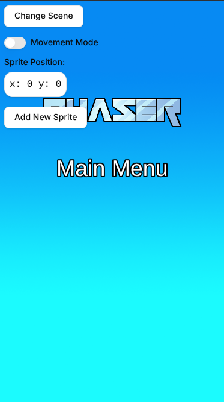
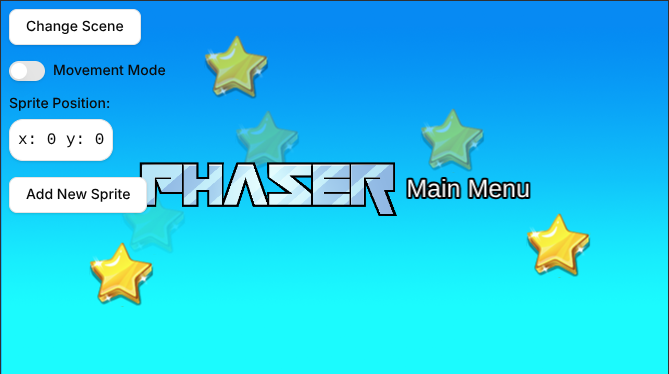

# Шаблон Phaser React TypeScript

Это шаблон проекта Phaser 3, который использует фреймворк React и Vite для сборки. Он включает в себя мост для взаимодействия React с игрой Phaser, горячую перезагрузку (hot-reloading) для быстрого процесса разработки и скрипты для генерации готовых к продакшену сборок.

**[Этот шаблон также доступен в версии на JavaScript.](https://github.com/phaserjs/template-react)**

### Версии

Этот шаблон был обновлен для:

- [Phaser 3.90.0](https://github.com/phaserjs/phaser)
- [React 19.0.0](https://github.com/facebook/react)
- [Vite 6.3.1](https://github.com/vitejs/vite)
- [TypeScript 5.7.2](https://github.com/microsoft/TypeScript)




## Требования

[Node.js](https://nodejs.org) требуется для установки зависимостей и запуска скриптов через `npm`.

## Доступные команды

| Команда               | Описание                                                                      |
| --------------------- | ----------------------------------------------------------------------------- |
| `npm install`         | Установка зависимостей проекта                                                |
| `npm run dev`         | Запуск локального веб-сервера разработки                                      |
| `npm run build`       | Создание продакшен-сборки в папке `dist`                                      |
| `npm run dev-nolog`   | Запуск сервера разработки без отправки анонимных данных (см. "О log.js" ниже) |
| `npm run build-nolog` | Создание продакшен-сборки без отправки анонимных данных (см. "О log.js" ниже) |

## Написание кода

После клонирования репозитория запустите `npm install` из директории вашего проекта. Затем вы можете запустить локальный сервер разработки, выполнив `npm run dev`.

Локальный сервер разработки по умолчанию запускается на `http://localhost:8080`. Пожалуйста, обратитесь к документации Vite, если хотите изменить это или добавить поддержку SSL.

Как только сервер будет запущен, вы сможете редактировать любые файлы в папке `src`. Vite автоматически перекомпилирует ваш код и перезагрузит браузер.

## Структура проекта шаблона

Мы предоставили структуру проекта по умолчанию, чтобы вы могли начать. Она выглядит следующим образом:

| Путь                   | Описание                                                                                       |
| ---------------------- | ---------------------------------------------------------------------------------------------- |
| `index.html`           | Базовая HTML-страница, содержащая игру.                                                        |
| `src`                  | Содержит исходный код клиента React.                                                           |
| `src/main.tsx`         | Основная точка входа **React**. Инициализирует приложение React.                               |
| `src/PhaserGame.tsx`   | Компонент React, который инициализирует игру Phaser и действует как мост между React и Phaser. |
| `src/vite-env.d.ts`    | Глобальные объявления TypeScript, предоставляющие информацию о типах.                          |
| `src/App.tsx`          | Основной компонент React.                                                                      |
| `src/game/EventBus.ts` | Простая шина событий для связи между React и Phaser.                                           |
| `src/game`             | Содержит исходный код игры.                                                                    |
| `src/game/main.tsx`    | Основная точка входа **игры**. Содержит конфигурацию игры и запускает её.                      |
| `src/game/scenes/`     | Папка, где располагаются сцены Phaser.                                                         |
| `public/style.css`     | Несколько простых правил CSS для помощи с макетом страницы.                                    |
| `public/assets`        | Содержит статические ресурсы, используемые игрой.                                              |

## Мост React (React Bridge)

Компонент `PhaserGame.tsx` является мостом между React и Phaser. Он инициализирует игру Phaser и передает события между ними.

Для связи между React и Phaser вы можете использовать файл **EventBus.js**. Это простая шина событий, которая позволяет отправлять и прослушивать события как из React, так и из Phaser.

```js
// В React
import { EventBus } from './EventBus';

// Отправка события
EventBus.emit('event-name', data);

// В Phaser
// Прослушивание события
EventBus.on('event-name', data => {
  // Делаем что-то с данными
});
```

Кроме того, компонент `PhaserGame` предоставляет экземпляр игры Phaser вместе с последней активной сценой Phaser, используя `forwardRef` из React.

После того как они станут доступны, вы сможете обращаться к ним как к любой обычной ссылке (ref) в React.

## Работа со сценами Phaser

В Phaser сцена — это жизненная сила вашей игры. Именно здесь живут ваши спрайты, игровая логика и все системы Phaser. Вы также можете запускать несколько сцен одновременно. Этот шаблон предоставляет способ получения текущей активной сцены из React.

Вы можете получить текущую сцену Phaser из события компонента `"current-active-scene"`. Для этого вам нужно отправить событие `"current-scene-ready"` из класса сцены Phaser. Это событие должно быть отправлено, когда сцена готова к использованию. Вы можете увидеть, как это сделано, во всех сценах нашего шаблона.

**Важно**: Когда вы добавляете новую сцену в свою игру, убедитесь, что вы предоставляете доступ к ней для React, отправляя событие `"current-scene-ready"` через `EventBus`, вот так:

```ts
class MyScene extends Phaser.Scene {
  constructor() {
    super('MyScene');
  }

  create() {
    // Ваши игровые объекты и логика здесь

    // В конце метода create:
    EventBus.emit('current-scene-ready', this);
  }
}
```

Вам не обязательно отправлять это событие, если вам не нужен доступ к конкретной сцене из React. Также вам не обязательно отправлять его в конце `create`, вы можете сделать это в любой момент. Например, если ваша сцена ожидает завершения сетевого запроса или вызова API, она может отправить событие, как только данные будут готовы.

### Пример компонента React

Вот пример того, как получить доступ к данным Phaser для использования в компоненте React:

```ts
import { useRef } from 'react';
import { IRefPhaserGame } from "./game/PhaserGame";

// В родительском компоненте
const ReactComponent = () => {

    const phaserRef = useRef<IRefPhaserGame>(); // вы можете получить доступ к этому ref через phaserRef.current

    const onCurrentActiveScene = (scene: Phaser.Scene) => {

        // Это вызывается

    }

    return (
        ...
        <PhaserGame ref={phaserRef} currentActiveScene={onCurrentActiveScene} />
        ...
    );

}
```

В приведенном выше коде вы можете получить ссылку на текущий экземпляр игры Phaser и текущую сцену, создав ссылку с помощью `useRef()` и назначив её компоненту PhaserGame.

Из этой ссылки на состояние экземпляр игры доступен через `phaserRef.current.game`, а последняя активная сцена — через `phaserRef.current.scene`.

Колбэк `onCurrentActiveScene` также будет вызываться каждый раз при изменении сцены Phaser, при условии, что вы отправляете событие через EventBus, как описано выше.

## Работа с ресурсами (ассетами)

Vite поддерживает загрузку ресурсов через операторы `import` в JavaScript-модулях.

Этот шаблон обеспечивает поддержку как встраивания ресурсов, так и их загрузки из статической папки. Чтобы встроить ресурс, вы можете импортировать его в начале JavaScript-файла, в котором вы его используете:

```js
import logoImg from './assets/logo.png';
```

Чтобы загрузить статические файлы, такие как аудиофайлы, видео и т.д., поместите их в папку `public/assets`. Затем вы можете использовать этот путь в вызовах загрузчика (Loader) внутри Phaser:

```js
preload();
{
  //  Это пример импортированного изображения, включенного в сборку.
  //  Не забудьте импортировать его в начале этого файла
  this.load.image('logo', logoImg);

  //  Это пример загрузки статического изображения
  //  из папки public/assets:
  this.load.image('background', 'assets/bg.png');
}
```

Когда вы выполняете команду `npm run build`, все статические ресурсы автоматически копируются в папку `dist/assets`.

## Развертывание в продакшене

После запуска команды `npm run build` ваш код будет собран в единый бандл и сохранен в папке `dist` вместе с любыми другими ресурсами, которые импортировал ваш проект или которые хранились в папке public assets.

Чтобы развернуть игру, вам нужно загрузить _все_ содержимое папки `dist` на общедоступный веб-сервер.

## Настройка шаблона

### Vite

Если вы хотите настроить свою сборку, например добавить плагин (скажем, для загрузки CSS или шрифтов), вы можете изменить файл `vite/config.*.mjs` для изменений, затрагивающих весь проект, или вы можете изменить и/или создать новые файлы конфигурации и указать их в конкретных задачах npm внутри `package.json`. Пожалуйста, обратитесь к [документации Vite](https://vitejs.dev/) для получения дополнительной информации.

## О log.js

Если вы проверите наши node-скрипты, вы увидите файл под названием `log.js`. Этот файл делает один тихий вызов API к домену `gryzor.co`. Этот домен принадлежит Phaser Studio Inc. Имя домена — это дань уважения одной из наших любимых ретро-игр.

Мы отправляем в этот API следующие 3 части данных: название используемого шаблона (vue, react и т.д.), был ли билд 'dev' или 'prod', и, наконец, используемую версию Phaser.

Никакие персональные данные не собираются и не отправляются. Мы ничего не знаем о файлах вашего проекта, устройстве, браузере или чем-либо еще. Не стесняйтесь проверить файл `log.js`, чтобы убедиться в этом.

Зачем мы это делаем? Поскольку мы являемся open source проектом, у нас нет видимых метрик о том, какие из наших шаблонов используются. Мы усердно работаем над поддержкой большого и разнообразного набора шаблонов для разработчиков Phaser, и это наш небольшой анонимный способ определить, окупается ли эта работа или нет. Короче говоря, это помогает нам убедиться, что мы создаем инструменты для вас.

Однако, если вы не хотите отправлять какие-либо данные, вы можете использовать эти команды вместо стандартных:

Dev:

```bash
npm run dev-nolog
```

Build:

```bash
npm run build-nolog
```

Или, чтобы полностью отключить лог, просто удалите файл `log.js` и удалите вызов к нему в разделе `scripts` файла `package.json`:

До:

```json
"scripts": {
    "dev": "node log.js dev & dev-template-script",
    "build": "node log.js build & build-template-script"
},
```

После:

```json
"scripts": {
    "dev": "dev-template-script",
    "build": "build-template-script"
},
```

Любой из этих способов остановит запуск `log.js`. Если вы решите это сделать, пожалуйста, хотя бы присоединитесь к нашему Discord и расскажите нам, какой шаблон вы используете! Или отправьте нам быстрое письмо по электронной почте. И то, и другое будет очень полезно, спасибо.

## Присоединяйтесь к сообществу Phaser!

Нам нравится видеть, что разработчики, такие как вы, создают с помощью Phaser! Это действительно мотивирует нас продолжать улучшения. Поэтому, пожалуйста, присоединяйтесь к нашему сообществу и покажите свою работу 😄

**Посетите:** [Веб-сайт Phaser](https://phaser.io) и подпишитесь на [Phaser в Twitter](https://twitter.com/phaser_)<br />
**Играйте:** Некоторые из удивительных игр [#madewithphaser](https://twitter.com/search?q=%23madewithphaser&src=typed_query&f=live)<br />
**Учитесь:** [API Docs](https://newdocs.phaser.io), [Форум поддержки](https://phaser.discourse.group/) и [StackOverflow](https://stackoverflow.com/questions/tagged/phaser-framework)<br />
**Discord:** Присоединяйтесь к нам в [Discord](https://discord.gg/phaser)<br />
**Код:** 2000+ [Примеров](https://labs.phaser.io)<br />
**Читайте:** Рассылку [Phaser World](https://phaser.io/community/newsletter)<br />

Создано [Phaser Studio](mailto:support@phaser.io). Работает на кофе, аниме, пикселях и любви.

Логотип и персонажи Phaser являются &copy; 2011 - 2025 Phaser Studio Inc.

Все права защищены.
